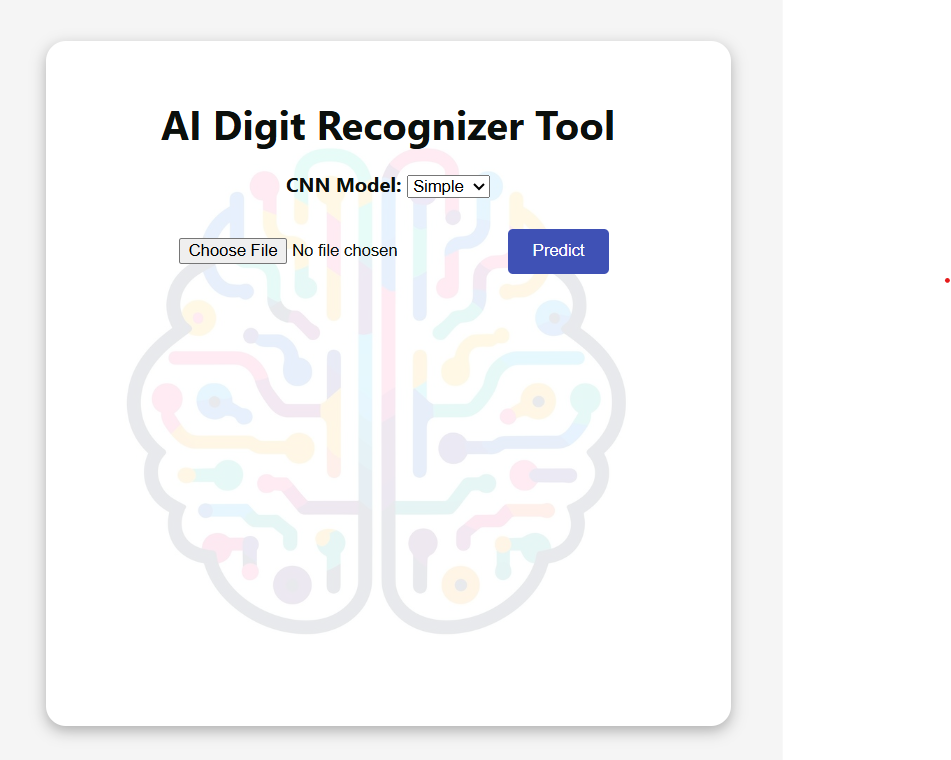
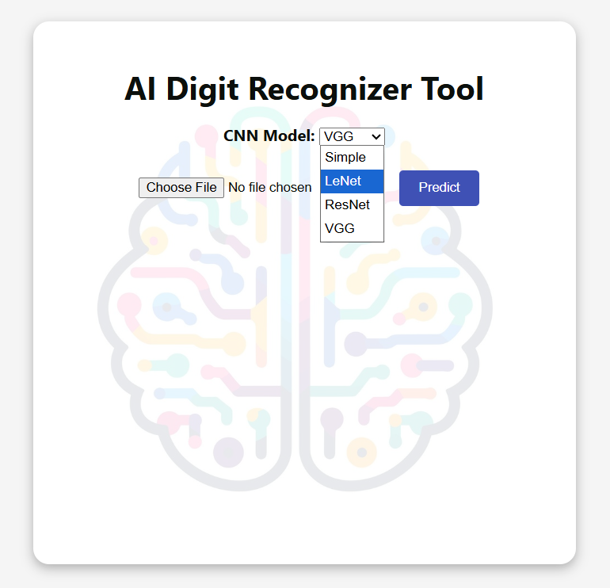
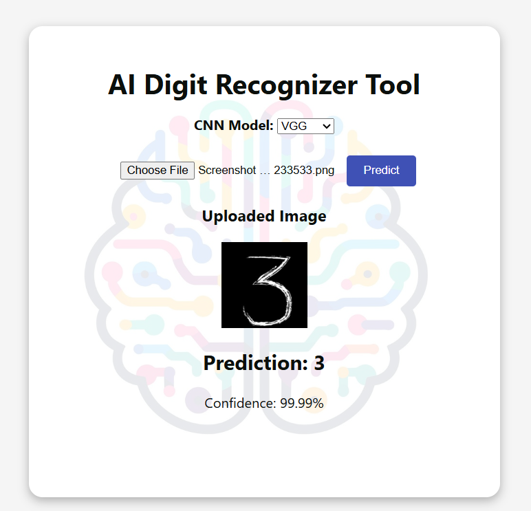

# 🧠 AI Digit Recognizer Tool

This project is a web-based AI-powered digit recognition app. Upload an image of a handwritten digit (0–9), choose a CNN model, and get the prediction(s)!

---

## 🔍 Demo Screenshots





---

## 📦 Tech Stack

- **Frontend**: React.js
- **Backend**: Flask
- **Models**: Custom-trained CNNs (Simple, LeNet, ResNet, and VGG)
- **Dataset**: MNIST

---

## 🚀 How to Run Locally

Step 1: Train the model(s)

```bash
cd model/
python train.py --arch {simple/lenet/resnet/vgg} --optimizer {adam/sgd/rmsprop} --epochs {epochs of training} --batch_size {mini batch size}

After training the model(s), you'll see mnist_{arch}_model.h5 files associated with the architecture you provided in training above

Step 2: Run the application

```bash
cd api/
python app.py

